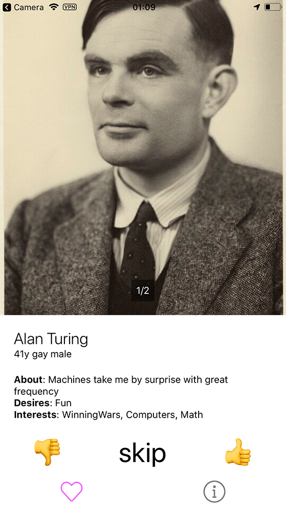
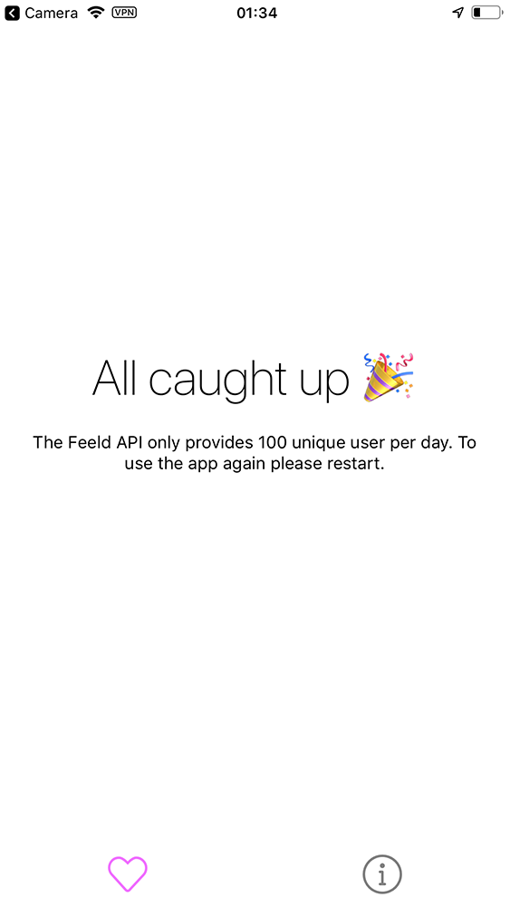
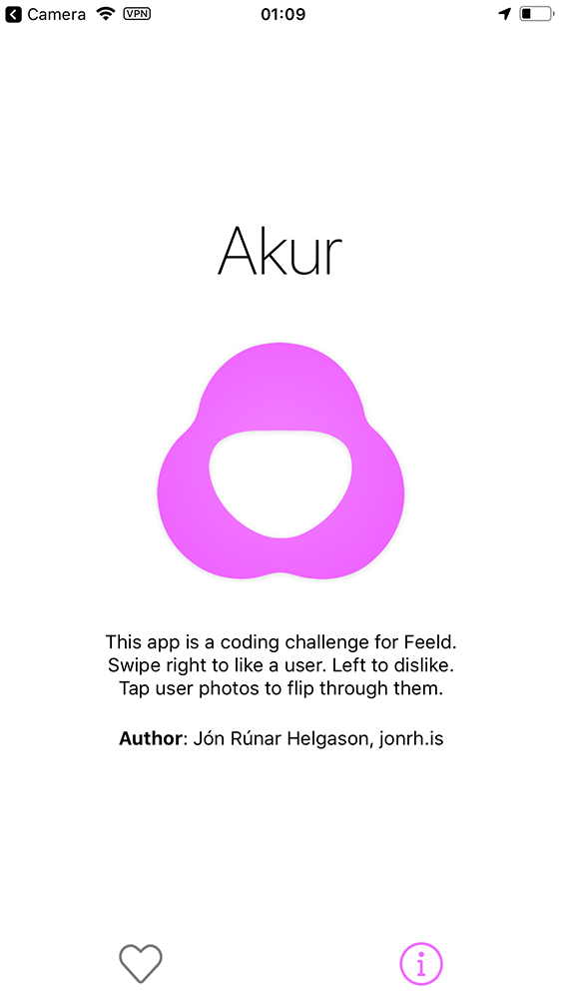
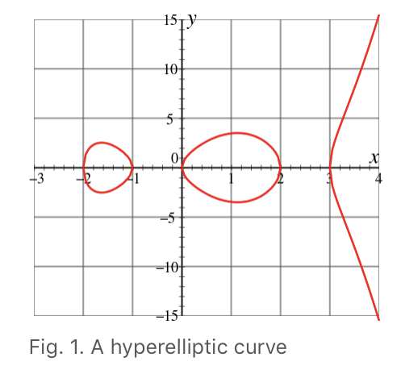
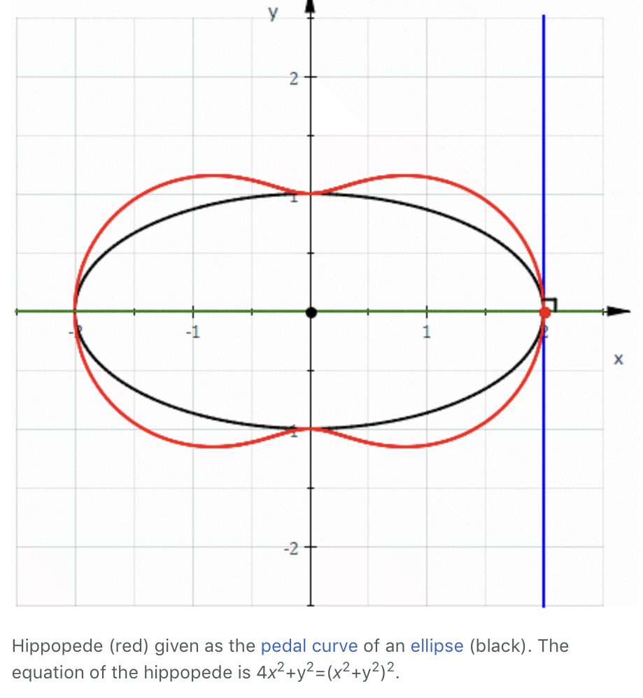
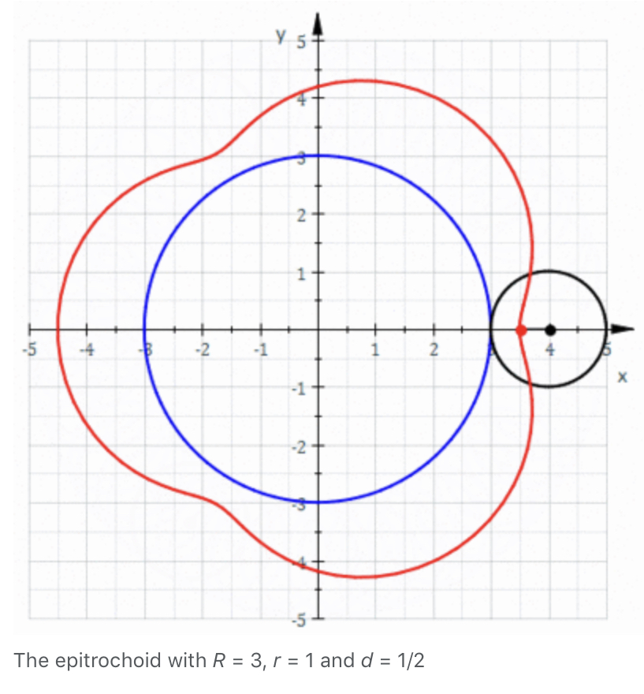
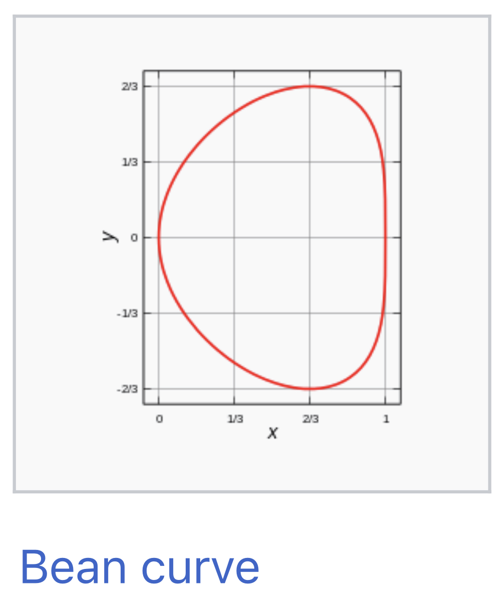
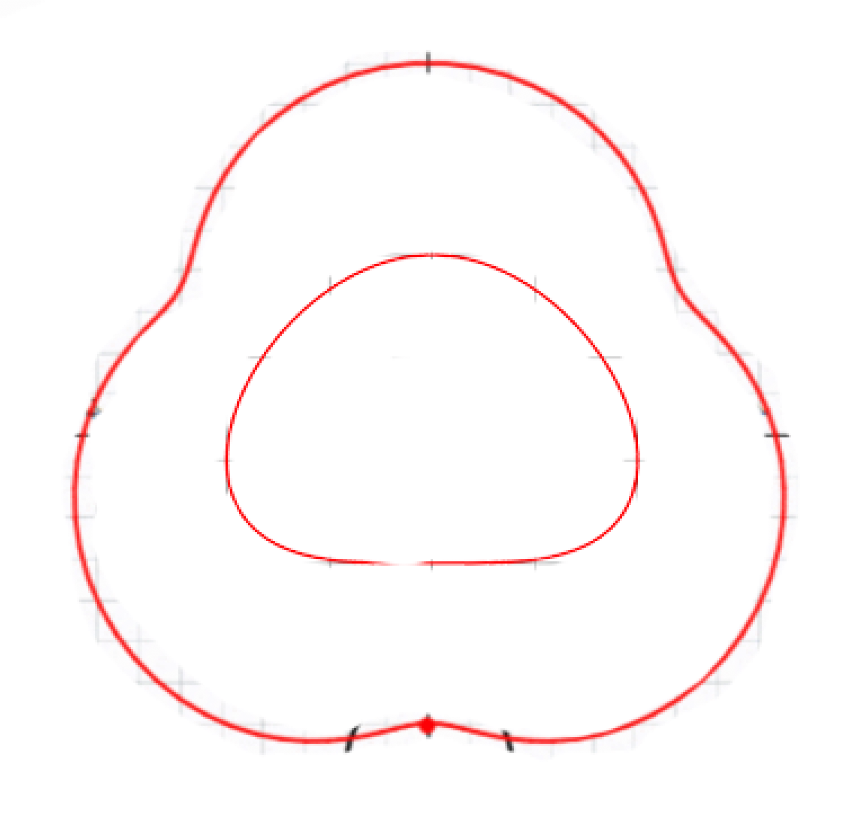

<p align="center">
	
</p>

<h2 align="center">Feeld Frontend Coding Challenge</h2>

<p align="center">
	<a href="https://prettier.io/">
		
	</a>
</p>

This is a [coding challenge](https://github.com/Feeld/frontend-developer-test) for the company
[Feeld](https://feeld.co/). The challenge took take place between 2019-07-27 and 2019-08-03. The
task was to create a dating app in [React Native](https://facebook.github.io/react-native/),
[Expo](https://expo.io/) and, [TypeScript](https://www.typescriptlang.org/).
[Here](./docs/demo_video.mov) is a high resolution demo video of the app in use.

<p align="center">
	
	
	
</p>

<p align="center">
	
</p>

TODO NOTE: THE CURRENTLY PUBLISHED VERSION IS NOT THE LATEST. WILL UPDATE ONCE PROJECT IS COMPLETE.
To quickly run this app on Android, install the
[Expo app](https://play.google.com/store/apps/details?id=host.exp.exponent&referrer=www) then scan
the QR code [here](https://expo.io/@jonrh/akur) or below with your with your camera:

<p align="center">
	
</p>

## How to run and develop on your own computer

1. Make sure you have recent version of [Node.js](https://nodejs.org/en/) installed. The latest
   LTS (long term support) version is a safe bet.

2. Install the [Expo client](https://expo.io/learn) command: `npm install expo-cli --global`
3. Install the [Android](https://play.google.com/store/apps/details?id=host.exp.exponent&hl=en) or [iOS](https://itunes.apple.com/app/apple-store/id982107779) Expo app on your phone.
4. Clone this repository to your own computer: `git clone https://github.com/jonrh/frontend-developer-test`
5. Move into the newly cloned folder and run `yarn install` or `npm install`
6. Run `yarn start` or `npm start`
7. The app will be complied and a browser window will open up. Open the camera on your mobile phone
   (or a QR scanning app) and scan the QR code in the lower left corner of the web page that opened
   up. The app should then load onto your phone. This assumes your computer and your mobile phone
   are on the same LAN network. If they are not try selecting "Tunnel" in the lower left and scan
   the QR code again.

## Architecture

For state management I kept it deliberately simple: React
[`setState()`](https://reactjs.org/docs/react-component.html#setstate). In previous apps I have
usually used [Redux](https://redux.js.org/). I tend to avoid it for small apps like this one but
use it when the benefits (reliability, predictability) start to outweigh the cost (boilerplate,
setup cost) once the app has grown to a certain size or complexity. I usually prefer `setState()`
until it starts to become painful to pass props and update functions down the chain (3-5 levels).
I would have liked to try to use
[useState hooks](https://reactjs.org/docs/hooks-reference.html#usestate) for this project but I
opted to limit my exposure to new stuff to reduce the risk of getting stuck.

For navigation I used the excellent library [react-navigation](https://reactnavigation.org/). I use
just a simple bottom tab bar with two screens and custom icons with purple brand colour.

Source code is automatically formatted with [Prettier](https://prettier.io/) and
[Husky git hooks](https://prettier.io/docs/en/precommit.html#option-2-pretty-quick-https-githubcom-azz-pretty-quick)
enforces that no nonformatted code can be commited into the repository (unless the hook is
bypassed).

## Bugs

- The image on the Info screen doesn't seem to be preloaded. When the screen opens the images loads
  in after a split second. I thought that images in the `asset/` folder, or local images included
  with `require()` didn't need to be prefetched in Expo.
- The swipe animation halts a bit towards the end. This enables a buggy behaviour where it is
  possible to rapidly tap the dislike/like buttons to juggle the user around.
- Some times I get a warnings when two children used the same `key` attribute. This originates from
  the `<Animated.View>` components in `DecideUsers.tsx`. I don't think it would be hard to fix but
  I simply ran out of time.

## Implementation Notes

- Originally I attempted to use
  [react-native-swiper](https://github.com/leecade/react-native-swiper) to swipe through photos of
  a single user. When I started experimenting with adding swiping left/right to make a dislike/like
  decision on users I ran into problems. I attempted to use a horizontal Swiper to dislike/like
  users and within that Swiper was another vertical Swiper for the photos of the user. It somewhat
  worked but I ran into state bugs I was not able to resolve. These efforts can be seen in the file
  `SwipTester.tsx` and `SwipeTester2.tsx`. This work can also be seen in the deprecated files
  `DecideUsersOld.tsx` and `UserViewOld.tsx` if you are curious.
- I spent quite a bit of time learning and playing with
  [Animated](https://facebook.github.io/react-native/docs/animated),
  [Reanimated](https://github.com/kmagiera/react-native-reanimated),
  [PanResponder](https://facebook.github.io/react-native/docs/panresponder.html), and
  [Gesture Handler](https://kmagiera.github.io/react-native-gesture-handler/) in an effort to
  implement swiping of users. I learned a lot but needed a lot more time to be able to create
  a user experience I would be willing to showcase. I based my swipe and gesture handling from a
  [React Native EU workshop](https://github.com/FormidableLabs/react-native-animation-workshop) I
  attended in 2017.
- I struggled quite a bit with gesture handlers competing with one another. In the current
  implementation I have two competing gesture handlers. Swipe left/right to dislike/like a user
  and tab a photo to flip through (if the user has multiple photos). When tapping photos the
  `onPress()` event sometimes wouldn't fire. I'm guessing because the swipe gesture handler stole
  focus. I have renewed respect for how complicated this can get! As a hack I opted for the handler
  method
  [`onPressIn()`](https://facebook.github.io/react-native/docs/touchablewithoutfeedback#onpressin).
  It works more reliably but the user experience is not ideal. Every time a swipe is performed on a
  user with multiple photos the next photo is toggled in.

## Logo Design

For this challenge I decided to have some fun and take a shot at designing a logo for Feeld. The
main themes I had in mind were:

- staying true to the roots of Feeld (an association with the number 3)
- simple round geometrical shape
- bright colours I wouldn't normally use

First I began [exploring](https://www.matematica.pt/en/useful/list-curves.php) and
[looking](http://paulbourke.net/geometry/) for the most
[erotic mathematical curves](https://faishasj.github.io/spirograph/) I could find.
After some browsing I found these the most pleasing:

<p align="center">
	
	
	
	
</p>

The ones I liked the most were the
[epitrochoid curve](https://en.wikipedia.org/wiki/Epitrochoid) (R=3, r=1, d=0.5) and the
[bean curve](https://en.wikipedia.org/wiki/Quartic_plane_curve#Bean_curve). Next I played around
in Photoshop and came up with this rough concept:

<p align="center">
	
</p>

I would have really enjoyed deriving the mathematical equations for creating this shape exactly
(in SVG for example) but since time was very short I instead just approximated the curve from the
rough raster concept with the _Curveture Pen Tool_ in Photoshop. After that I had a shape and
just played around a little bit with gradients and drop shadows. Here are the final results:

<p align="center">
	
	
</p>

## Files & Folders

- `.expo/`: I'm not sure what this folder does. It's not tracked in Git so probably something
  generated by Expo to do with local development.
- `assets/`: Images (app icon, splash screen), fonts, videos that the app uses.
- `node_modules/`: Third party JavaScript dependencies. This folder is created and populated after
  running the command `yarn install` or `npm install`. This folder should not be modified.
- `source/`: Contains the source code of the app.
  - `components/`: React components that should aim to be re-usable
  - `graveyard/`: Components I used when developing and prototyping solutions.
  - `screens/`: High level views of the app, each file is a screen in the app
  - `utilities/`: Other various TypeScript code, for example types, API code, etc.
  - `Main.tsx`: The root component of the app.
- `.gitignore`: Specifies what files and folders we don't want to keep track of in our
  [Git](https://git-scm.com/) repository.
- `.watchmanconfig`: Configuration file for Watchman. Used by Expo to listen for events when files
  change, for example on file saves.
- `app.json`: App configurations that do not belong to code. Name of app, SDK versions to use, etc.
- `App.tsx`: The main entry point into the app as dictated by the Expo framework. Just a shell that
  redirects to `source/Main.tsx`.
- `babel.config.js`: [Configuration file](https://babeljs.io/docs/en/configuration) for
  [Babel](https://babeljs.io/), a JavaScript & TypeScript transformer.
- `package.json`: List of third party dependencies (such as JavaScript or Typescript), project
  settings and scripts to run the project. More info [here](https://docs.npmjs.com/files/package.json).
- `prettier.config.js`: Settings file for our automatic source code formatter
  [Prettier](https://prettier.io/). Prettier comes with some
- `readme.md`: This document. Introductory text to help readers understand what this is and how to
  get started developing.
- `tsconfig.json`: [Configuration file](https://www.typescriptlang.org/docs/handbook/tsconfig-json.html)
  to specify compiler options for TypeScript.
- `yarn.lock`: An autogenerated file by the [Yarn](https://yarnpkg.com/lang/en/docs/yarn-lock/)
  package manager. It allows us to get consistent installs across machines. Avoids rare but very
  painful inconsistency bugs.

## Work in progress note:

- I noticed a user had an interest with an emoji. I should make sure that emojis can render
  properly in text elements. I forgot if they did or not. I just remember that in Creact React App
  emojis need to be put into <span> elements with the correct attributes. Just wondering if the same
  applies here for React Native. **Update**: This turned out to be no problem.
- I discovered that the response from the API can contain the same user multiple times in the same
  request. I created a script outside the project that called the API about 30 times and extracted
  all 100 unique user objects and put them in the `users.ts` file.
- There is a bug in react-native-swiper. Sometimes the photo state doesn't get updated correctly
  when flipping through photos. A user can flip through the photos, it's just that the UX isn't
  optimal because the photos don't loop around.
- \<SafeWorkingArea> doesn't seem to work on Android as I expected. The app reaches all the way to
  the top of the screen and extends under the toolbar. This behaviour actually looks pretty nice on
  the Decision screen (photos reach all at the way to the top) but not on the Info and Chat screens.

---

# Original Challenge Description by Feeld

Hi! welcome to Feeld. As part of the recruitment process we want to know how you think, code and
structure your work. In order to do that, we're going to ask you to complete this coding challenge.

## Some background

Feeld is a dating app. People are free to browse profiles and decide whether they like them or not.

## What we expect

- Build a performant, clean and well structured solution;
- Commit early and often. We want to be able to check your progress;
- Feel free to address the problem creatively according to your programming tastes (there are
  always multiple ways to achieve the same goal) and try to use elegant solutions.
- Feeld.co is a design-driven app. Your solution should look _modern, relevant, simple and in line
  with our brand image_
- Go the extra mile. The requirements below are just the bare minimum. Be creative and come up with
  a solution that will impress us. If you think our requirements are whack, or not appropriate,
  change them and explain why
- You have **one week** to complete this challenge

## The Challenge

Our backend team has created an API that will give you a bunch of user profiles, and you have been
given some (very lose) requirements from the product team

- You must build an app that displays these users in an atractive way (think Tinder, Grindr,
  Happn, Hinge)
- The API will return the following information about a user:

```
{
    "id": "55be3c8fc964860700ebf515",
    "info": {
        "age": 20,
        "type": "single",
        "gender": "male",
        "sexuality": "straight",
        "name": "D",
        // a short text about them
        "about": "\"Tell us more about you\"",
        // a list of desires
        "desires": [
            "Food"
        ],
        // a list of tags they're interested in
        "interests": [
            "Food"
        ]
    },
    "associated": null, // if they're a couple, this will be populated
    "photos": [ // this will be a list of zero or more photos
        {
            "url": "...",
            "width": 716,
            "height": 716
        }
    ]
}
```

- A user should be able to make a decision (Like or Dislike) on the user, but they don't _have_ to,
  i.e. they can skip the profile.
- The user should be able to browse another user's photos

## Accessing the API

API Root URL: https://fld-devtest-api.herokuapp.com

The API is authenticated using the following session token that must be supplied in the HTTP
request headers (using the `session-token` key):

```
3TtY+AVtEJMaOPWGyEulVEgVBWZ8gqM75gag6wCcA3rJCYWMkX/ZmAOJxrZ4bPyBLJBch7VyMYD8ZCWoNPCUnJbT5M2iRWjJteGrfNhFzd+0oDbWQwiNAIdG0W9rHw7sKAAWk5uEzjs+lPykJnmy56LRwSFpoyxHC7p9G3KTQoQ=
```

### Endpoints

There's only one—`/api/v1/users`—which will return 20 unique users picked at random from a set of
100 users. You can call this endpoint using Curl as follows:

```
curl -H 'session-token: 3TtY+AVtEJMaOPWGyEulVEgVBWZ8gqM75gag6wCcA3rJCYWMkX/ZmAOJxrZ4bPyBLJBch7VyMYD8ZCWoNPCUnJbT5M2iRWjJteGrfNhFzd+0oDbWQwiNAIdG0W9rHw7sKAAWk5uEzjs+lPykJnmy56LRwSFpoyxHC7p9G3KTQoQ=' \
https://fld-devtest-api.herokuapp.com/api/v1/users
```

## Your task:

1. Fork this repo
2. Produce an expo React Native app that calls the provided API and displays users. Make it public
   and send us a link so we can open it
3. Create a readme file explaining your technical choices, architecture and if you have them, your
   ideas and suggestions.
4. Send us a PR.

GOOD LUCK!
